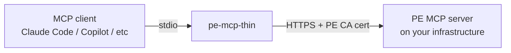

# Why pe-mcp-thin is a proxy, not a direct client

This explains the *why* behind the design — for the *how*, see
[../README.md](../README.md) (quickstart) and [../CHEATSHEET.md](../CHEATSHEET.md)
(full command reference).

## The core shape: stdio in, HTTPS out

Every MCP client — Claude Code, GitHub Copilot, any other — talks to local
MCP servers over **stdio**: the client spawns a process and exchanges
JSON-RPC over its stdin/stdout. But the actual PE MCP server isn't local —
it's a service running somewhere on your Puppet Enterprise infrastructure,
reachable only over **HTTPS**, behind TLS signed by your PE's own
Certificate Authority.

`pe-mcp-thin` exists purely to bridge that gap: it's a tiny local process
that speaks stdio to your MCP client on one side, and HTTPS to the real PE
MCP server on the other, forwarding every call through unchanged
([`proxy.py`](../proxy.py) — built on [FastMCP](https://gofastmcp.com)'s
`create_proxy`). It holds no state and implements no tools of its own; every
tool you see (`puppet_node_lookup`, `get_device_info`, etc.) comes from
whichever PE MCP server it's pointed at.

## Why not just point the client at HTTPS directly?

Most MCP clients' stdio transport doesn't know how to speak HTTPS to a
server signed by a private, non-public CA — and even where a client *does*
support remote HTTP MCP servers directly, you'd still need to distribute
your PE CA cert and any RBAC token to every client's own config format. A
thin local proxy means:

- **One artifact, any client.** The same `pe-mcp-thin serve` command works
  identically whether it's wired into Claude Code, Copilot, or something
  else — the client-specific integration surface is just "run this stdio
  command," which every MCP client already supports.
- **Auth/TLS handled once, centrally.** `PE_CA_CERT` and (when needed)
  `PE_RBAC_TOKEN` are read once by the proxy, not re-implemented per client.
- **Deploy independently of the client.** `pe-mcp-thin` ships and versions
  on its own — nothing about it is coupled to any particular MCP client's
  release cycle.

## Why three install paths, and why uvx is the default recommendation

`uvx --from git+...` (see [README Quickstart](../README.md#quickstart-fastest--no-install))
needs nothing persistent — `uv` fetches, builds, and runs the package in an
ephemeral environment, and this is also exactly the mechanism used by tools
like PAG that manage MCP servers on your behalf via a registry entry. `pip
install` and Docker exist as alternatives for environments where `uv` isn't
available or a persistent, pre-built artifact is preferred — Docker
specifically was chosen over, say, a native OS package because it needed to
work identically across Linux/macOS without per-platform build steps, at the
cost of not yet being published anywhere (see [CHEATSHEET.md](../CHEATSHEET.md#docker-local-build--not-yet-published-to-docker-hub)
for why and the local-build workaround).

## Two targets, one client — the `PE_RBAC_TOKEN` design choice

`pe-mcp-thin` can point at either of two different PE MCP servers (see
[README](../README.md#which-pe-mcp-target-am-i-connecting-to)): a
standalone decoupled MCP that needs no auth, or the older
`pe-infra-assistant` MCP built into PE itself, which is RBAC-gated. Rather
than branching the client's code per target, `proxy.py` always reads
`PE_RBAC_TOKEN` and forwards it as the `X-Authentication` header
unconditionally — an absent value simply sends no header at all. This keeps
the client's logic target-agnostic: which server actually *checks* that
header is PE's decision, not this proxy's.

## Related Topics

- [../README.md](../README.md) — quickstart, all three install paths
- [../CHEATSHEET.md](../CHEATSHEET.md) — full command reference, verified output, troubleshooting
- [FastMCP](https://gofastmcp.com) — the library `proxy.py` is built on
- [`puppetlabs-pe_mcp`](https://github.com/puppetlabs/puppetlabs-pe_mcp) — deploys the decoupled MCP target this proxy connects to
