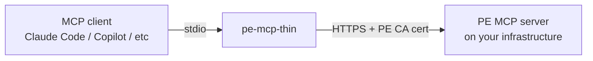

---
tags:
  - -inbox/pag
---
# Why pe-mcp-thin is a proxy, not a direct client

## Purpose

This document answers:

- Why does `pe-mcp-thin` exist as a separate stdio→HTTPS proxy at all, rather than each MCP client speaking to the PE MCP server directly?
- Why are there three install paths (`uvx`, `pip`, Docker), and what does the choice of default (`uvx --from git+...`) reveal about how MCP clients and registry-driven tools like PAG launch servers?
- Why does the proxy forward `PE_RBAC_TOKEN` **unconditionally** to both PE MCP target flavours instead of branching per-target, and what does that say about where auth policy actually lives in this stack?

## Background

Written while shipping `pe-mcp-thin` 1.0.2 (adds `PE_RBAC_TOKEN` support for the RBAC-gated `pe-infra-assistant` target). The *shape* of the stack is as follows: three moving parts (MCP clients, a local bridge, a remote PE-hosted MCP server) that only compose the way they do because MCP client stdio transports, PE's private CA, and PE RBAC each carry constraints that a "just point the client at HTTPS" design would violate.

## Key Concepts

### stdio in, HTTPS out

Every MCP client — Claude Code, GitHub Copilot, any other — talks to local MCP servers over **stdio**: the client spawns a process and exchanges JSON-RPC over its stdin/stdout. But the actual PE MCP server isn't local — it's a service running somewhere on your Puppet Enterprise infrastructure, reachable only over **HTTPS**, behind TLS signed by your PE's own Certificate Authority.

`pe-mcp-thin` exists purely to bridge that gap: it's a tiny local process that speaks stdio to your MCP client on one side, and HTTPS to the real PE MCP server on the other, forwarding every call through unchanged (built on [FastMCP](https://gofastmcp.com)'s `create_proxy`). It holds no state and implements no tools of its own; every tool you see (`puppet_node_lookup`, `get_device_info`, etc.) comes from whichever PE MCP server it's pointed at.



**Code Location:** [`proxy.py:96-104`](https://github.com/puppetlabs/pe_mcp_docker/blob/554ed0b8359d8202ffa7b83c6606ad3561153613/proxy.py#L96-L104)

**Code Sample:**

```python
transport = StreamableHttpTransport(
    REMOTE_MCP_URL,
    headers=AUTH_HEADERS,
    httpx_client_factory=_httpx_client_factory,
)
client = Client(transport)
proxy = create_proxy(client, name="PE Thin MCP Proxy")

if __name__ == "__main__":
    proxy.run(transport="stdio")
```

- The whole proxy is these ~10 lines: an HTTPS transport pointed at the remote PE MCP, wrapped in a FastMCP `Client`, wrapped in `create_proxy(...)`, run with `transport="stdio"`.
- `create_proxy` is what makes this a passthrough rather than a re-implementation — tools and calls appear from the remote server, not from this file.
- The stdio/HTTPS asymmetry is the *entire* reason this file exists: change either side to match the other and the proxy disappears.

### Why not just point the client at HTTPS directly

Most MCP clients' stdio transport doesn't know how to speak HTTPS to a server signed by a private, non-public CA — and even where a client *does* support remote HTTP MCP servers directly, you'd still need to distribute your PE CA cert and any RBAC token to every client's own config format. A thin local proxy means:

- **One artifact, any client.** The same `pe-mcp-thin serve` command works identically whether it's wired into Claude Code, Copilot, or something else — the client-specific integration surface is just "run this stdio command," which every MCP client already supports.
- **Auth/TLS handled once, centrally.** `PE_CA_CERT` and `PE_RBAC_TOKEN` are read once by the proxy, not re-implemented per client.
- **Deploy independently of the client.** `pe-mcp-thin` ships and versions on its own — nothing about it is coupled to any particular MCP client's release cycle.

### Three install paths, and why uvx is the default

`uvx --from git+...` (see [README Quickstart](../README.md#quickstart-fastest--no-install)) needs nothing persistent — `uv` fetches, builds, and runs the package in an ephemeral environment, and this is also exactly the mechanism used by tools like PAG that manage MCP servers on your behalf via a registry entry. `pip install` and Docker exist as alternatives for environments where `uv` isn't available or a persistent, pre-built artifact is preferred — Docker specifically was chosen over, say, a native OS package because it needed to work identically across Linux/macOS without per-platform build steps, at the cost of not yet being published anywhere (see [CHEATSHEET.md](../CHEATSHEET.md#docker-local-build--not-yet-published-to-docker-hub) for why and the local-build workaround).

### Two targets, one client — the PE_RBAC_TOKEN design choice

`pe-mcp-thin` can point at either of two different PE MCP servers (see [README](../README.md#which-pe-mcp-target-am-i-connecting-to)): a standalone decoupled MCP, or the older `pe-infra-assistant` MCP built into PE itself, both of which are RBAC-gated. Rather than branching the client's code per target, `proxy.py` always reads `PE_RBAC_TOKEN` and forwards it as the `X-Authentication` header when present.  This keeps the client's logic target-agnostic: which server actually *checks* that header is PE's decision, not this proxy's.

**Code Location:** [`proxy.py:30-36`](https://github.com/puppetlabs/pe_mcp_docker/blob/554ed0b8359d8202ffa7b83c6606ad3561153613/proxy.py#L30-L36)

**Code Sample:**

```python
RBAC_TOKEN = os.environ.get("PE_RBAC_TOKEN", "").strip()

# Where nginx in front of the PE MCP gates on PE RBAC, the token goes in the
# X-Authentication header; without it every request comes back 401. Not every
# deployment gates on RBAC, so an empty/unset token is valid: send no header
# at all rather than an empty one, which some proxies reject outright.
AUTH_HEADERS = {"X-Authentication": RBAC_TOKEN} if RBAC_TOKEN else {}
```

- `PE_RBAC_TOKEN` is read from the environment once at startup and forwarded verbatim in every request via `X-Authentication`.
- The `if RBAC_TOKEN else {}` guard is the entire "target-awareness" the proxy has — an empty/unset token means no header at all, so the same binary works against both the decoupled (no-auth) and `pe-infra-assistant` (RBAC-gated) targets without a mode flag.
- Enforcement lives at PE's nginx layer, not here — the proxy is deliberately unopinionated about which target it's talking to.

## Related Topics

- [../README.md](../README.md) — quickstart, all three install paths
- [../CHEATSHEET.md](../CHEATSHEET.md) — full command reference, verified output, troubleshooting
- [FastMCP](https://gofastmcp.com) — the library `proxy.py` is built on
- [`puppetlabs-pe_mcp`](https://github.com/puppetlabs/puppetlabs-pe_mcp) — deploys the decoupled MCP target this proxy connects to
