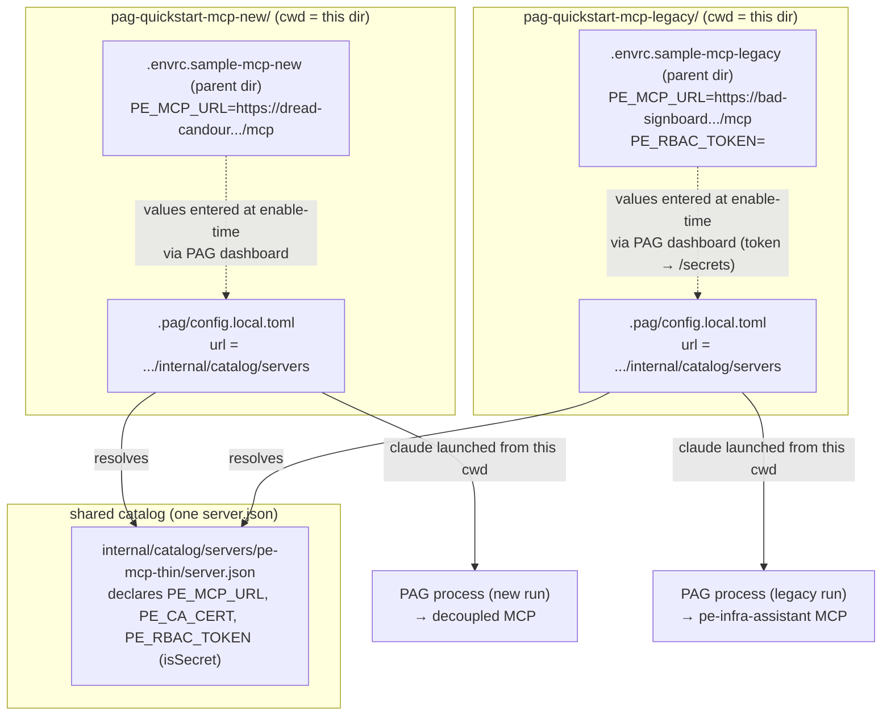

# PAG testing

## Purpose

This document answers:

- What is PAG's **devcatalog** override actually for, and what does — and does not — a local test through it verify about a `server.json` before it goes to the hosted registry?
- Why does testing `pe-mcp-thin` need **two flavours** of PE MCP target (legacy Infra Assistant vs. new decoupled MCP), and how does the same `server.json` cover both?
- What are the small set of load-bearing conventions (`server.json` naming, `[[registries]]` shape, `PE_MCP_URL` trailing-slash rule, `PE_RBAC_TOKEN` secret handling) whose violation produces silent failures rather than clear errors?

## Background

This directory was carved out while shipping `pe-mcp-thin` 1.0.2 — the release that adds `PE_RBAC_TOKEN` support so the same thin client can front both the **decoupled** PE MCP (new, ignores the token) and the **legacy** `pe-infra-assistant` MCP (PE 2025.11+, gates on the token via `X-Authentication`). The registry entry needed a new declared env var, `isSecret: true` for that env var, and a `runtimeArguments --from` bump — all of which are silent-failure-prone at the PAG-catalog layer. The two `pag-quickstart-mcp-*` project directories and the one canonical `server.json` under `internal/catalog/servers/pe-mcp-thin/` are the reusable rig that proved the change end-to-end before Noah published it.

The document's subject is not that release — it's the **domain mechanics** the rig exercises: PAG's `devcatalog` override, per-directory scoping, the `server.json`-name convention, and the target-flavour matrix that any future `server.json` edit will need to be rerun through.

## Key Concepts

> Each concept is a domain fact about PAG registry testing that the artifacts in this directory verify. Read the concept first; the artifacts are examples of the concept, not the point of it.

### Devcatalog is a client-side shadow, not a registry-side test

PAG resolves servers from an ordered list of `[[registries]]` in its config, first-match wins. A registry of `type = "devcatalog"` with a `file://` URL points at a local directory; PAG loads it **before** the hosted `mcp-registry` entry of the same name. That means editing your local file and refreshing PAG's catalog is enough to make your unpublished `server.json` become the one PAG enables and runs — nothing on Noah's hosted registry has to change, and no other user sees your edit.

The important corollary: what this proves is the **shape and runtime behaviour of the record you'll eventually publish** — env-var declarations, `isRequired` / `isSecret` flags, `runtimeArguments --from` pointing at the right git ref, the tool list PAG surfaces once the server starts. It does **not** exercise the hosted registry's write path (that only happens when Noah publishes), and it does **not** exercise PE connectivity from the registry side — for that you still need a real PE MCP target behind whatever URL you set. See [`../../README.md`](../../README.md) for what standing up a PE MCP entails.

**Concrete artifact in this directory:** [`internal/catalog/servers/pe-mcp-thin/server.json`](internal/catalog/servers/pe-mcp-thin/server.json) — the one file both `pag-quickstart-mcp-*` project directories resolve through. Note `packages[0].runtimeArguments[0].value` points at a branch (`@gavins-rbac-token`) rather than a tag: the devcatalog run is what proves the branch's uvx-installable form works before it becomes `@v1.0.2`.

### The `.pag/` shadow is scoped to one directory, not one repo

`claude mcp add pag` is repo-wide and only sets up PAG itself. The **catalog override**, however, is read from `.pag/config.local.toml` in the exact directory the PAG process was launched with as its cwd. A Claude Code session that started in a sibling directory — or the repo root, or your home directory — will not see this directory's override, even if it looks a directory-tree away.

That is why this directory ships **two** sibling project directories, [`pag-quickstart-mcp-legacy/`](pag-quickstart-mcp-legacy/) and [`pag-quickstart-mcp-new/`](pag-quickstart-mcp-new/), each with its own `.pag/config.local.toml`. Each is a self-contained cwd you `cd` into and start `claude` from; the config it reads is right there in `.pag/`. The two configs happen to point at the same catalog root (`internal/catalog/servers`), so both directories resolve the same `server.json` — the split exists so each MCP flavour keeps its own `.rerun.json`, `bolt-debug.log`, and any PAG-written `.pag/config.toml{,.lock}` state without cross-contaminating the other.

**Concrete artifact:** [`pag-quickstart-mcp-new/.pag/config.local.toml`](pag-quickstart-mcp-new/.pag/config.local.toml) — three lines that do the work:

```toml
version = 1

[[registries]]
type = "devcatalog"
url = "file:////Users/gavin.didrichsen/@REFERENCES/github/app/development/tools/puppet/pag-testing/uvx/internal/catalog/servers"
```

Both `version = 1` (top-level, mandatory — its absence surfaces as a silent PAG disconnect inside the client, not a config error) and the `[[registries]]` header are load-bearing. Missing the header fails silently. See also the sibling [`pag-quickstart-mcp-legacy/.pag/config.local.toml`](pag-quickstart-mcp-legacy/.pag/config.local.toml), which is byte-identical — the two rigs differ only in which MCP flavour you point them at at run time (next concept).

### The devcatalog filename convention is `server.json`, exact

Devcatalog scans the immediate children of `url` for one file named literally `server.json` per subdirectory. The publish-side convention — files named `<version>.json` (e.g. `1.0.2.json`) that get committed into the hosted registry — is **invisible to devcatalog**. Pointing `url` at a directory whose only files are `1.0.2.json` returns zero results, no error message, no log line — PAG just reports `Registry file://…: no data available (unreachable or empty cache)`, which reads like a caching issue but is actually the naming convention biting.

This directory therefore uses the devcatalog name at [`internal/catalog/servers/pe-mcp-thin/server.json`](internal/catalog/servers/pe-mcp-thin/server.json) — the parent, `internal/catalog/servers`, is what `url` points at; `pe-mcp-thin/` is one server's subdirectory; `server.json` is the literal filename. When you publish this same record for real, it becomes `internal/catalog/servers/pe-mcp-thin/<version>.json` in the hosted registry checkout — a separate step, done by renaming/copying, not by devcatalog.

### The same `server.json` covers both MCP flavours; only two env-var values change

The `server.json` declares three env vars — `PE_MCP_URL`, `PE_CA_CERT`, `PE_RBAC_TOKEN` — of which only the last is `isSecret: true`. What distinguishes the two MCP flavours is not the `server.json` shape but the **values you enter at enable-time**:

| Flavour | `PE_MCP_URL` (example) | `PE_RBAC_TOKEN` behaviour |
| --- | --- | --- |
| **Decoupled MCP** (new, `puppetlabs-pe_mcp` module) | `https://dread-candour.delivery.puppetlabs.net/mcp` | ignored — sent, but the target doesn't check it. Absent/blank/fake all PASS. |
| **Legacy Infra Assistant** (PE 2025.11+, `pe-infra-assistant`) | `https://bad-signboard.delivery.puppetlabs.net/mcp` | required — nginx in front of the MCP gates on PE RBAC. Absent → 401 with the actionable hint in [`selftest.py`](../../selftest.py). |

This is why testing `pe-mcp-thin` end-to-end takes **two devcatalog runs, not two `server.json`s**: same file, same registry override, different values entered in PAG's dashboard (or `.pag/config.toml`'s `[servers.…inputs]` block that PAG writes itself after the first enable). If `isRequired: true` on `PE_RBAC_TOKEN` is set correctly, the dashboard nags for a value in both cases — but only the legacy target actually fails without one at runtime; `isRequired` is a dashboard concern, not a runtime gate. See the `.envrc.sample` files below for the two value sets used here.

**Concrete artifacts:**

- [`.envrc.sample-mcp-new`](.envrc.sample-mcp-new) — the decoupled-target values. `PE_RBAC_TOKEN` can be anything (including blank).
- [`.envrc.sample-mcp-legacy`](.envrc.sample-mcp-legacy) — the legacy-target values, including a placeholder for a real `PE_RBAC_TOKEN` fetched via `puppet-access login`.

### Secrets go through the dashboard, not chat, not `config.local.toml`

Because `PE_RBAC_TOKEN` is declared `isSecret: true` in the `server.json`, PAG will refuse to accept it via chat and will not persist it to `.pag/config.local.toml` alongside the non-secret inputs. It goes in at `http://localhost:<port>/servers/<alias>/secrets` — the exact URL is printed in `pag__enable_server`'s response. Non-secret inputs (`PE_MCP_URL`, `PE_CA_CERT`) can go through chat, and PAG writes them into `.pag/config.toml` (not `config.local.toml`, which is yours) under `[servers.<alias>.inputs]`.

This is why the `.envrc.sample-*` files in this directory are **shell exports for the CLI/`uvx` path**, not files PAG reads — the same target values, but consumed by native `pe-mcp-thin validate` for a pre-PAG sanity check. Never commit either file with a real token filled in; the placeholders `<LONG_LONG_RBAC_TOKEN>` are deliberate.

### Trailing slash on `PE_MCP_URL` fails silently after auth

`PE_MCP_URL` **must have no trailing slash**. A trailing `/` gets appended to by the proxy's own path handling and produces `.../mcp/` on the wire, which — against the legacy target — 404s **after** the RBAC check passes. That means a working token plus a wrong URL looks like "session terminated" or "empty tool list" rather than a clear 404 diagnostic. As of `pe-mcp-thin` 1.0.2 the entrypoint and the Python client both strip trailing slashes defensively, but hand-edited `[servers.…inputs.PE_MCP_URL].value` fields in older `.pag/config.toml` files or hand-typed dashboard entries still hit this. See the "Gotchas" section of [`../cheatsheet_pe_mcp_docker.md`](../cheatsheet_pe_mcp_docker.md).

## How the pieces fit together

Two directions of scoping meet inside `docs/pag-testing/`: the **override** points at one shared catalog, and each **quickstart** is a distinct cwd PAG is scoped to. Same `server.json`, two runtime targets, two `.pag/` states.



The sequence of one flavour's test — starting from a `.pag/`-clean state — is:

```mermaid
sequenceDiagram
    participant You
    participant Shell as Shell in pag-quickstart-mcp-new/
    participant Claude as claude / PAG
    participant Dash as PAG dashboard
    participant Target as Decoupled PE MCP

    You->>Shell: cd pag-quickstart-mcp-new/
    You->>Shell: (verify .pag/config.local.toml url is absolute)
    Shell->>Claude: claude
    Claude->>Claude: read .pag/config.local.toml (per-cwd)
    You->>Claude: refresh the pag catalog and list servers
    Claude-->>You: com.perforce/pe-mcp-thin (file://...) + hosted entry
    You->>Claude: enable pe-mcp-thin
    Claude->>You: needs PE_MCP_URL, PE_CA_CERT; secret PE_RBAC_TOKEN → dashboard
    You->>Claude: PE_MCP_URL=https://dread-candour.../mcp, PE_CA_CERT=/tmp/pe-ca.pem
    You->>Dash: paste PE_RBAC_TOKEN (or leave blank — ignored by decoupled)
    Claude->>Target: uvx pe-mcp-thin serve → MCP stdio
    Target-->>Claude: tools/list → 10 tools
    Claude-->>You: enabled, pag_state=running
    You->>Claude: call puppet_environment_status
    Claude->>Target: X-Authentication (if token set), request
    Target-->>Claude: environments payload
    Claude-->>You: PASS
```

Rerun the same sequence in `pag-quickstart-mcp-legacy/` with the legacy URL and a **real** `PE_RBAC_TOKEN`; a missing/expired token there produces a 401 with the actionable hint from [`selftest.py`](../../selftest.py) rather than an opaque stack trace.

## Using this directory to test a new `server.json` variant

Concrete workflow, once you understand the concepts above. Read this as an application of the concepts, not a substitute for them.

### Edit `internal/catalog/servers/pe-mcp-thin/server.json`

Make the change you want to prove — e.g. flip `PE_RBAC_TOKEN`'s `isRequired`, bump `runtimeArguments[0].value`'s branch to point at a new `@feature-branch`, add a new declared env var. The file is the devcatalog's canonical copy for this directory; both quickstart projects resolve through it.

### Verify the override loads (one flavour at a time)

Pick a flavour. From this repo's root:

```bash
cd docs/pag-testing/pag-quickstart-mcp-new     # or pag-quickstart-mcp-legacy
# confirm .pag/config.local.toml's url is an ABSOLUTE path to
# docs/pag-testing/internal/catalog/servers on YOUR machine
```

Edit the `url` if the checkout path differs from the value already in the file. The path must be absolute (`file:///abs/path`, three slashes) — a relative or `~`-based path fails silently.

Then either restart your live Claude Code session from **this** directory, or run the isolated verifier described in [[cheatsheet_pag_verification]] to confirm the override loads without disturbing your current session:

```bash
python3 /path/to/pag_devcatalog_verify.py "$(pwd)" puppet-enterprise
# expect 2 results: one file://.../internal/catalog/servers (this override),
# one https://pag-registry... (the hosted entry). Zero results = override not loading.
```

Search matches the registry `name`/`title` (`com.perforce/pe-mcp-thin` / whatever your `title` is), **not** `packages[].identifier` — searching `pe-mcp-thin` alone may return nothing depending on how the entry is titled. Set `title` to something obviously local (e.g. `... (DEVCATALOG)`) if you want an unambiguous visual signal that PAG picked up your copy and not the hosted one.

### Enable and exercise, once per flavour

In-chat, in the same directory the session was launched from:

```
enable pe-mcp-thin
```

PAG prints the dashboard URL it needs `PE_RBAC_TOKEN` at. Fill in the values matching this flavour:

- **Decoupled (new)** — values from [`.envrc.sample-mcp-new`](.envrc.sample-mcp-new). Any value (or blank) for `PE_RBAC_TOKEN` works; the target ignores it. Expect `pag_state: running`, then a real tool call like `puppet_environment_status` succeeds.
- **Legacy (`pe-infra-assistant`)** — values from [`.envrc.sample-mcp-legacy`](.envrc.sample-mcp-legacy). A **real** `PE_RBAC_TOKEN` from `puppet-access login --lifetime 1y`. Absent/blank → 401 with the hint from [`selftest.py`](../../selftest.py); real token → same success as above.

Repeat the whole sequence in the other quickstart directory to prove both flavours before hand-off.

### Tear down or you keep shadowing the hosted entry

Once your `server.json` variant is either published or discarded, delete or comment out the `[[registries]]` block in each `.pag/config.local.toml` — otherwise every future session started from this directory keeps loading the local file, hiding any changes to the hosted entry. If PAG's cached state gets stuck (e.g. dashboard keeps nagging for a token after you saved it, or `pag_state` never leaves `starting`), delete `.pag/config.toml` and `.pag/config.toml.lock` — PAG regenerates them on the next enable.

## Related Topics

- [`../cheatsheet_pe_mcp_docker.md`](../cheatsheet_pe_mcp_docker.md) — operational commands for `pe-mcp-thin` itself (uvx, pip, Docker); the CLI-side sanity check you can run before wiring anything into PAG.
- [`../explanation_why_pe_mcp_thin_is_a_proxy_not_a_direct_client.md`](../explanation_why_pe_mcp_thin_is_a_proxy_not_a_direct_client.md) — why this client is a stdio↔HTTPS proxy in the first place; frames what PAG is being pointed at.
- [`../howto_pe_mcp_docker_release.md`](../howto_pe_mcp_docker_release.md) — release procedure, whose post-flight includes rerunning both `pag-quickstart-mcp-*` flavours through this same rig after the tag ships.
- [[cheatsheet_pag]] — the general PAG operational reference (Path A hosted / Path B devcatalog, publish flow) this document specialises for `pe-mcp-thin`.
- [[cheatsheet_pag_verification]] — glance-and-go commands and the `pag_devcatalog_verify.py` script referenced above.
- [[howto_how_to_point_pag_at_any_pe_mcp_endpoint_by_swapping_one_env_var]] — the same override mechanism, viewed from the "aim PAG at a different endpoint without editing `server.json`" angle.
- [[howto_how_to_add_or_update_a_pag_registry_entry_for_pe_mcp_or_any_perforce_mcp_server]] — the write path (send to Noah) that this local test is the pre-flight for.
- [[explanation_pag_perforce_agentic_gateway_overview]] — durable mental model for PAG (client + registry), the 5 compliance gates, what devcatalog does and does not verify.
- [[cheatsheet_pe_rbac_token_testing_for_pe_mcp_thin_1_0_2]] — why the two MCP flavours differ on `PE_RBAC_TOKEN` behaviour, plus token generation commands.
- [PAG](https://github.com/perforce/perforce-agentic-gateway) — the gateway this devcatalog override is a feature of.
- [`puppetlabs-pe_mcp`](https://github.com/puppetlabs/puppetlabs-pe_mcp) — the module that deploys the decoupled MCP target the "new" quickstart aims at.
